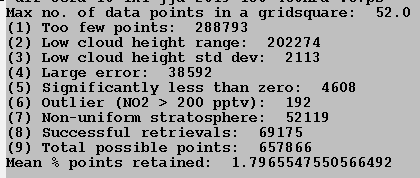

Gallery
==================

Plots output with uptrop using cartopy include three panels of global maps showing cloud-sliced nitrogen dioxide (NO2) mixing ratios at the pressure range of interest (top), the estimated error on the cloud-sliced NO2 mixing ratios, and the number of cloud-sliced values

The example below is from cloud-slicing TROPOMI NO2 in June-August 2019 at 450-180 hPa (~8-12 km):

Also output to a log file with each cloud-slicing routine are diagnostics that track the maximum number of satellite pixels in the target grid, the number of satellite pixels removed in each data filtering step, the total number of successful cloud-slicing retrievals compared to the total number that could have been retrieved, and the percent of total TROPOMI pixels used for cloud slicing:

