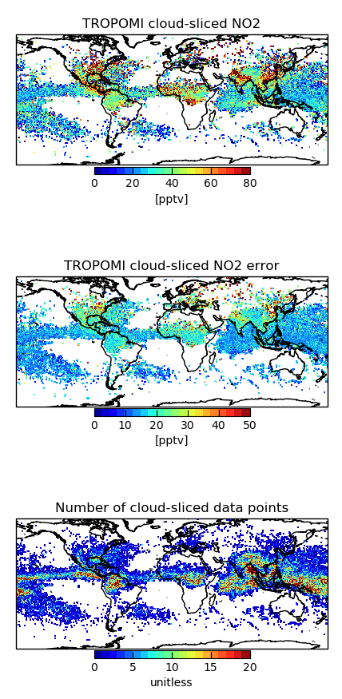

Gallery
==================

Plots output with uptrop using cartopy include three panels of global maps showing cloud-sliced nitrogen dioxide (NO2) mixing ratios at the pressure range of interest (top), the estimated error on the cloud-sliced NO2 mixing ratios, and the number of cloud-sliced values. These are not publication quality plots, but are merely for sanity checking and benchmarking.

The example below is from cloud-slicing TROPOMI NO2 in June-August 2019 at 450-180 hPa (~8-12 km):

| This is a line

Also output to a log file with each cloud-slicing routine are diagnostics that track the maximum number of satellite pixels in the target grid, the number of satellite pixels removed in each data filtering step, the total number of successful cloud-slicing retrievals compared to the total number that could have been retrieved, and the percent of total TROPOMI pixels used for cloud slicing:

.. code-block:: text

  Max no. of data points in a gridsquare:  64.0
  (1) Too few points:  280605
  (2) Low cloud height range:  260019
  (3) Low cloud height std dev:  2105
  (4) Large error:  0
  (5) Significantly less than zero:  15664
  (6) Outlier (NO2 > 200 pptv):  0
  (7) Non-uniform stratosphere:  133461
  (8) Successful retrievals:  83516
  (9) Total possible points:  775370
  Mean % points retained:  2.141713715255334
  
The printout above indicates that the gid with the most cloud-sliced NO2 retrievals has 64 data points,
that, of all valid clusters of satellite pixels within the pressure range of interest, 280,605 have too few coincident 
points, 260,019 have a cloud height range that is less than required, 2,105 have a cloud height stnadrd deviation
that is less than required, 0 have too large a cloud-sliced NO2 error, 15,664 have cloud-sliced NO2 that is 
statistically significantly less than zero, that 0 are outliers, and that for 133,461 the overlying stratospheric
NO2 is not uniform. Also included in the printout is that there were 83,516 successful retrievals out of a total of
775,370, and that of all satellite pixels 2.14% are good quality, fall within the cloud pressure range of interest over
optically thick clouds.
